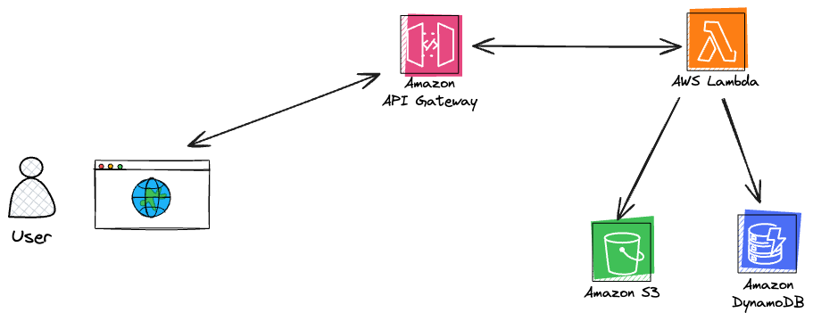

# ServerlessMovieApi Project

This project came from [phase 2](https://learntocloud.guide/phase2/) of the learn to cloud guide. The goal is to create an API with serverless functions that display movie information.

I wrote some notes on issues observed and anything else here in this [doc](Notes.md).

### It involved 3 steps:

- Creating cloud infrastructure as code (NoSQL database, storage solution and serverless function)
- Preparing the movie data uploading it in the database and storage solution
- Creating serverless functions to query all movie data and another function for movies per year provided by the client

[All movie data can be viewed here](https://1sxwpeubpk.execute-api.us-east-1.amazonaws.com/prod/). You need to use the release years shown in the data to search by year using the next link.

[Movies per year can be viewed here](https://1sxwpeubpk.execute-api.us-east-1.amazonaws.com/prod/getmoviesbyyear?releaseyear=2016). You can pass different release years such as 1999 or 2016.

## System Design Diagram

